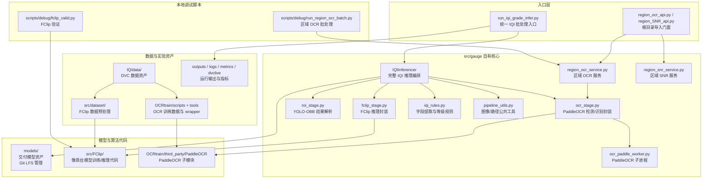
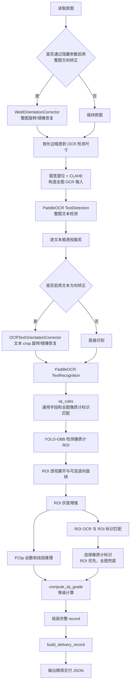

# IQIdet 架构说明

本文档面向后续代码维护者和 agent，说明本工程的代码边界、推理主链路、训练数据链路和运行资产组织。它不是交付调用手册；具体命令和 JSON 字段说明仍以 `集成引导.md`、`docs/README_IQI_GRADE_INFERENCE_DELIVERY.md` 为准，模型资产维护见 `docs/MODEL_ASSETS.md`。

## 项目定位

IQIdet 用于焊缝底片中的像质计等级识别。当前工程把任务拆成四类能力：

- 像质计 ROI 检测：在整张底片上定位像质计区域，主要使用 YOLO-OBB。
- OCR 识别：在整图或裁剪区域中识别焊道号、片号、部件代号、管道规格、像质计标识等文本。
- 像质丝识别：在像质计 ROI 内识别丝数和线段端点，主要使用 FClip。
- 等级判断：将像质计标识类型、编号和丝数融合成最终等级。

工程还包含两个旁路 API：区域 OCR 识别和区域归一化信噪比计算，供前端框选区域时调用。这两条旁路能力复用部分图像处理、OCR 子进程和服务封装，但不参与完整 IQI 等级主流程。

## 顶层架构

核心架构可以分为入口层、编排层、算法 stage、模型/数据资产四层。

`src/` 是源码根目录，`src/gauge/` 是当前项目最主要的自有代码边界。完整等级识别入口统一从 `run_iqi_grade_infer.py` 进入，最终都会进入 Python 包 `gauge.iqi_inferencer` 中的 `IQIInferencer`，再由它调用 OCR、ROI、FClip 和规则模块。根目录只保留交付入口和对外导入门面；本地调试脚本放在 `scripts/debug/`。`src/FClip/` 是像质丝模型代码，`OCRtrain/third_party/PaddleOCR` 是第三方 PaddleOCR 子模块，二者不要和 `src/gauge/` 的业务编排层混在一起理解。

## 目录与代码边界

根目录脚本承担入口职责：

- `run_iqi_grade_infer.py`：统一 IQI 批处理入口，默认输出精简后的交付 JSON；本地调试可使用隐藏参数启用整图方向矫正。
- `region_ocr_api.py`、`region_SNR_api.py`：根目录导入门面，向集成侧隐藏 `src/gauge/` 内部路径。

本地调试脚本集中放在 `scripts/debug/`：

- `scripts/debug/run_region_ocr_batch.py`：对已裁剪文字区域做批量区域 OCR。
- `scripts/debug/fclip_valid.py`：对 FClip checkpoint 做丝数验证、可视化和误差统计。

`src/gauge/` 是完整 IQI 推理与区域服务的核心目录。运行时导入包名仍是 `gauge`：

- `iqi_inferencer.py`：主编排服务，连接整图 OCR、字段规则、ROI 检测、ROI OCR、FClip 和等级计算。
- `iqi_rules.py`：纯业务规则层，负责 OCR 字段提取、像质计标识解析、等级计算和结果码定义。
- `ocr_stage.py`：OCR stage 封装，包含 PaddleOCR 子进程客户端、检测/识别结果归一化、逐文本框裁剪识别和 OCR 可视化辅助。
- `ocr_paddle_worker.py`：实际创建 PaddleOCR TextDetection/TextRecognition 的 worker 进程，通过 stdin/stdout JSON 与主进程通信。
- `roi_stage.py`：从 Ultralytics YOLO-OBB 结果中选择最佳像质计 ROI，并生成 ROI 可视化。
- `fclip_stage.py`：加载 FClip checkpoint，对 ROI 灰度图推理丝数与线段，并把 ROI 坐标映射回原图。
- `pipeline_utils.py`：图像读取、收集、透视裁剪、ROI 旋转、窗宽窗位增强、灰度转换等公共工具。
- `ocr_orientation.py`、`weld_correction.py`：文本 crop 方向矫正和整图方向矫正模型封装。
- `region_ocr_service.py`、`region_ocr_api.py`：区域 OCR 服务及 FastAPI 风格请求/响应封装。
- `region_snr_service.py`、`region_snr_api.py`：区域归一化信噪比服务及 FastAPI 风格请求/响应封装。
- `train.py`、`convert_to_yolo_obb.py`、`custom_augment.py`：像质计 ROI 检测训练相关工具。

`src/FClip/` 是像质丝识别模型代码。当前推理侧通过 Python 包 `FClip.infer_utils` 构建模型、预处理 ROI 灰度图、解析 heatmap/count 输出；训练侧通过 `FClip.train`、`FClip.trainer`、`FClip.datasets` 使用 `src/dataset/weld.py` 生成的数据训练 HRNet backbone 的多任务 FClip 模型。

`src/dataset/` 主要服务 FClip 训练。当前 IQI 路线最关键的是 `src/dataset/weld.py`：它从 LabelMe 标注中裁剪像质计 ROI，映射像质丝线段，生成 FClip 训练所需的图像和 `_line.npz` 热力图/偏移/角度/count 标签。

`OCRtrain/` 是 OCR 识别训练工程。`OCRtrain/scripts/` 负责构建来源图切分、直接从原图跑 TextDetection 导出文本 crop、合并标注数据、生成 PaddleOCR 训练配置；`OCRtrain/tools/` 负责人工转录工具以及 train/eval/export wrapper；`OCRtrain/third_party/PaddleOCR` 是官方 PaddleOCR 子模块，训练入口来自这里。

`models/` 保存交付推理需要的模型资产，例如 ROI 检测权重、FClip checkpoint/config、PaddleOCR rec 推理模型、文本方向矫正模型。该目录通过 Git LFS 管理，模型清单和更新流程见 `docs/MODEL_ASSETS.md`。

`IQIdata/` 保存原始和处理后的数据资产，部分由 DVC 管理。`local/`、`outputs/`、`logs/`、`metrics/`、`dvclive/` 更多是本地数据、运行输出、训练日志和实验指标目录，不应被当成核心源码层。

## 推理主流程

完整 IQI 等级识别由 `IQIInferencer.infer_image_path()` 编排。`run_iqi_grade_infer.py` 默认只暴露交付参数；整图方向矫正能力仍保留在同一入口中，但通过 argparse 隐藏参数启用，用于本地调试而不出现在 `--help` 和交付说明中。

全图 OCR 是当前主流程的前置步骤。它不仅用于像质计标识，还负责提取焊道号、片号、检测部件代号和管道规格。ROI 检测和 FClip 不依赖全图字段是否识别成功，但最终 `ok/result_code` 表示的是 IQI 主任务是否成功，而不是通用字段是否成功。

像质计标识有两个来源：全图 OCR 和 ROI OCR。ROI OCR 成功时优先使用 ROI 结果；ROI OCR 失败但全图 OCR 成功时回退到全图结果；两者都失败时按标识解析失败输出。FClip 在 ROI 有效时运行，即使标识失败也会保留丝数推理结果，便于诊断标识规则和丝数模型的问题。

OCR 运行在独立子进程中。主进程通过 `PaddleOCRSubprocessClient` 启动 `src/gauge/ocr_paddle_worker.py`，把图像编码成 PNG base64 后发送 JSON 请求，worker 返回检测或识别结果。这是为了隔离 PaddleOCR 与 PyTorch/Ultralytics/FClip 在同一进程内可能出现的 GPU runtime 冲突。

## 核心模块职责

`src/gauge/iqi_inferencer.py` 是主状态聚合点。它负责创建模型实例、管理 OCR worker 生命周期、组织单图 record、收集 warnings/errors、映射 ROI 坐标回原图、生成 visualization payload，并为交付入口生成精简记录。这个文件知道各 stage 的执行顺序，但具体算法细节尽量下沉到 stage 或规则模块。

`src/gauge/iqi_rules.py` 是业务规则核心。它维护结果码表、OCR 文本归一化、焊道号/片号/部件代号/管道规格提取、像质计标识候选构造、允许编号范围解析、等级计算和错误优先级选择。该模块基本不依赖模型和图像库，适合保持为可单独测试的纯逻辑层。

`src/gauge/ocr_stage.py` 封装 PaddleOCR 交互和 OCR 结果结构。`infer_roi_ocr()` 的命名来自早期 ROI OCR，但当前也被全图 OCR 复用：它先跑 TextDetection，再逐框裁剪、可选文本方向矫正、TextRecognition，最后返回 `items/all_items/texts/scores/timings_ms` 等统一结构。

`src/gauge/roi_stage.py` 只处理 YOLO-OBB 输出解析。它从 Ultralytics result 中读取 `obb.xyxyxyxy/conf/cls`，按置信度或面积选择一个 ROI，并转换为统一的 `polygon/bbox/conf/class_id`。

`src/gauge/fclip_stage.py` 是 FClip 推理适配层。它加载 `FClip` 模型配置和 checkpoint，把 ROI 灰度图缩放归一化后获取 heatmap，解析丝数和线段，并将线段从 FClip 输出坐标变换到 ROI 坐标、未旋转 ROI 坐标和原图坐标。

`src/gauge/pipeline_utils.py` 是图像处理基础设施。主流程中的图片收集、读取、长边缩放、四点排序、透视裁剪、ROI 横向转竖向、窗宽窗位增强、CLAHE、灰度转换都来自这里。训练脚本中也有部分相似逻辑，但推理主链应优先复用这里的实现。

`src/gauge/region_ocr_service.py` 和 `src/gauge/region_snr_service.py` 是独立区域服务。区域 OCR 复用 OCR worker 和文本方向矫正，但只对输入 crop 做增强、矫正和单次识别；区域 SNR 不依赖深度学习模型，只做灰度统计、测量信噪比和归一化信噪比计算。

## 训练与数据生产链路

ROI 检测训练链路由 `dvc.yaml` 中的 `gauge_preprocess` 和 `train_gauge` 描述。`src/gauge/convert_to_yolo_obb.py` 从 LabelMe polygon 标注生成 YOLO-OBB 数据集，输出 `images/train`、`images/val`、`labels/train`、`labels/val` 和 `data.yaml`。`src/gauge/train.py` 读取 `params.yaml` 的 `gauge_train` 配置，使用 Ultralytics YOLO 训练 OBB 检测器，并把结果指标写入 `metrics/gauge_metrics.json`。

FClip 像质丝训练链路由 `dvc.yaml` 中的 `preprocess_fclip` 和 `train_fclip` 描述。`src/dataset/weld.py` 读取原图和 LabelMe 标注，将像质计 polygon 裁剪成 ROI，把位于 polygon 内的 line 标注映射到 ROI 坐标，按规则做旋转、增强和简单翻转扩增，生成 FClip 需要的 `.png` 与 `_line.npz`。`src/FClip/train.py` 读取 `config/model.yaml` 和 `params.yaml`，构建 HRNet backbone + 多任务 head，训练 lcmap/lcoff/lleng/angle/count 输出。

OCR 识别训练链路独立于 `dvc.yaml` 主训练图。当前 `OCRtrain/scripts/export_text_crops.py` 直接从一个或多个原图目录运行 PaddleOCR TextDetection，导出 `det_crops/all/...`、来源 manifest、crop manifest 和可选文本框可视化。人工转录可使用 `OCRtrain/tools/label_rec_no_box.py` 或 `OCRtrain/scripts/transcribe_server.py`。随后 `OCRtrain/scripts/build_rec_dataset.py` 或合并脚本生成 `train.txt/val.txt/dict.txt`，`OCRtrain/scripts/prepare_train_config.py` 从 PaddleOCR 子模块基础配置生成训练配置，`OCRtrain/tools/train_rec.sh`、`eval_rec.sh`、`export_rec.sh` 分别执行训练、评估和推理模型导出。

这三条训练链路产出的模型最终在推理入口中通过参数或默认路径接入：ROI 检测权重用于 Ultralytics YOLO，FClip checkpoint/config 用于 `FClipInferencer`，PaddleOCR rec 导出模型目录用于 OCR worker 的 TextRecognition。

## 运行资产与输出形态

`models/` 是交付运行时默认模型目录，由 Git LFS 管理。典型资产包括 YOLO-OBB 权重、FClip checkpoint、FClip config、PaddleOCR rec inference 模型和 OCR 文本方向矫正模型。代码中通常允许通过命令行参数覆盖这些路径；模型清单和更新流程见 `docs/MODEL_ASSETS.md`。

`IQIdata/` 是项目数据资产目录。`dvc.yaml` 和 `params.yaml` 默认引用 `IQIdata/ori/img`、`IQIdata/ori/label`、`IQIdata/processed`、`IQIdata/gauge_obb` 等路径。`IQIdata/OCRdata` 保存 OCR 训练数据时也可由 DVC 管理。

`outputs/` 保存推理输出和可视化结果。统一入口输出批量 JSON，schema 为 `iqi_grade_batch_v1`；开启 `--vis-dir` 时会额外保存调试可视化图像。`logs/`、`metrics/`、`dvclive/` 主要来自训练和实验记录。

`OCRtrain/generated/`、`OCRtrain/runs/`、`local/OCRdatasets/` 等目录更偏本地中间产物。它们服务训练和标注工作流，不应被写成稳定运行时 API。

## 设计约束与注意点

统一入口和核心服务共用 `IQIInferencer`，因此主流程行为应优先在核心服务层保持一致。入口脚本主要负责参数解析、输入图片收集、输出 JSON、可视化保存和统计字段裁剪。整图方向矫正参数在 CLI 中隐藏，默认关闭，避免对外交付接口增加不必要的公开参数面。

规则层与模型层应保持分离。OCR 文本如何修正、像质计标识如何判定、等级如何计算属于 `iqi_rules.py`；图像裁剪、模型加载和坐标变换不应混入规则层。

PaddleOCR 子进程隔离是当前运行结构的一部分。直接在主进程中创建 PaddleOCR 可能重新引入 Paddle 与 Torch/Ultralytics/FClip 的 GPU runtime 冲突。

`OCRtrain/third_party/PaddleOCR` 是第三方源码子模块，项目自有的 OCR 训练逻辑在 `OCRtrain/scripts/` 和 `OCRtrain/tools/`。修改 OCR 训练流程时，应优先调整 wrapper 和生成配置逻辑，而不是直接改第三方源码。

`src/FClip/` 同时承担训练和推理模型代码。推理主流程不要直接散落调用 FClip 内部函数，应通过 `src/gauge/fclip_stage.py` 维持统一适配层，避免训练实现细节扩散到业务编排层。

现有 `docs/` 文档更偏交付流程、字段解释和历史方案；本文档只维护代码架构和边界。当交付 JSON 或命令参数发生变化时，应同步更新对应交付说明；当模块职责、主流程或训练链路发生变化时，应同步更新本文档。
