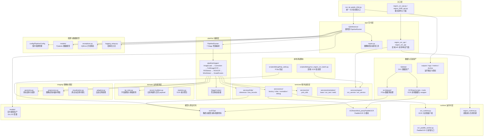
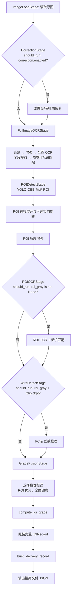

# IQIdet 架构说明

本文档面向后续代码维护者和 agent，说明本工程的代码边界、推理主链路、训练数据链路和运行资产组织。它不是交付调用手册；具体命令和 JSON 字段说明仍以 `集成引导.md`、`docs/README_IQI_GRADE_INFERENCE_DELIVERY.md` 为准，模型资产维护见 `docs/MODEL_ASSETS.md`。

## 项目定位

IQIdet 用于焊缝底片中的像质计等级识别。当前工程把任务拆成四类能力：

- 像质计 ROI 检测：在整张底片上定位像质计区域，主要使用 YOLO-OBB。
- OCR 识别：在整图或裁剪区域中识别焊道号、片号、部件代号、管道规格、像质计标识等文本。
- 像质丝识别：在像质计 ROI 内识别丝数和线段端点，主要使用 FClip。
- 等级判断：将像质计标识类型、编号和丝数融合成最终等级。

工程还包含两个旁路 API：区域 OCR 识别和区域归一化信噪比计算，供前端框选区域时调用。这两条旁路能力复用部分图像处理、OCR 子进程和服务封装，但不参与完整 IQI 等级主流程。

## 顶层架构

核心架构可以分为入口层、交付/编排层、业务/图像/运行时层、服务适配层、模型/数据资产五层。



`src/` 是源码根目录，`src/gauge/` 是当前项目最主要的自有代码边界。完整等级识别入口统一从 `run_iqi_grade_infer.py` 进入，最终都会进入 Python 包 `gauge.iqi_inferencer` 中的 `IQIInferencer`，再由它委托 `PipelineRunner` 依次执行 7 个 Stage。根目录只保留交付入口和对外导入门面；本地调试脚本放在 `scripts/debug/`。`src/FClip/` 是像质丝模型代码，`OCRtrain/third_party/PaddleOCR` 是第三方 PaddleOCR 子模块，二者不要和 `src/gauge/` 的业务编排层混在一起理解。

## 目录与代码边界

根目录脚本承担入口职责：

- `run_iqi_grade_infer.py`：统一 IQI 批处理入口，默认输出精简后的交付 JSON；本地调试可使用隐藏参数启用整图方向矫正。
- `region_ocr_api.py`、`region_SNR_api.py`：根目录导入门面，向集成侧隐藏 `src/gauge/` 内部路径。

本地调试脚本集中放在 `scripts/debug/`：

- `scripts/debug/run_region_ocr_batch.py`：对已裁剪文字区域做批量区域 OCR。
- `scripts/debug/fclip_valid.py`：对 FClip checkpoint 做丝数验证、可视化和误差统计。

`src/gauge/` 是完整 IQI 推理与区域服务的核心目录，按职责分为六层。运行时导入包名仍是 `gauge`：

### 交付层 `app/`

对外门面、模型资源生命周期和 delivery payload 组装。可依赖所有其他层。

- `app/iqi_inferencer.py`：`IQIInferencer` — 主编排服务入口，创建 PipelineRunner 和管理模型资源生命周期、生成 visualization payload、构建交付 record。
- `app/inputs.py`：`collect_input_images` — 图像收集与路径工具。
- `app/region_ocr_api.py`、`app/region_snr_api.py`：区域 API 的 FastAPI 请求/响应封装。

### 编排层 `pipeline/`

管道编排和状态管理。可依赖 `domain/`、`imaging/`、`services/`、`models/`、`config/`。

- `pipeline/runner.py`：`PipelineRunner` — 7 个 Stage 的顺序编排器，处理异常传播（`IQIError` 记录并继续，普通 `Exception` 停止并返回错误 record）。
- `pipeline/context.py`：`StageContext`（Pydantic 模型，管道状态容器）。
- `pipeline/stages/`：7 个独立 Stage 类，每个实现 `PipelineStage` 接口（`should_run` + `run`）。
  - `base.py`：`PipelineStage`（ABC）。
  - `image_load.py`：`ImageLoadStage` — 读取图像，记录尺寸。
  - `correction.py`：`CorrectionStage` — 整图方向矫正。
  - `full_image_ocr.py`：`FullImageOCRStage` — 缩放 → 增强 → 全图 OCR → 字段提取 → 像质计标识匹配。
  - `roi_detect.py`：`ROIDetectStage` — YOLO-OBB 检测 → 透视裁剪 → 旋转 → 灰度增强。
  - `roi_ocr.py`：`ROIOCRStage` — ROI OCR + 标识匹配 + 坐标投影。
  - `wire_detect.py`：`WireDetectStage` — FClip 丝数推理。
  - `grade_fusion.py`：`GradeFusionStage` — 选择最优标识 → 等级计算 → 错误汇总。

### 业务规则层 `domain/`

纯业务逻辑，只依赖标准库和 `models/`。不依赖 OpenCV、Numpy、Torch、PaddleOCR、Ultralytics。

- `domain/iqi_rules.py`：OCR 字段提取、像质计标识解析、等级计算和结果码定义。
- `domain/record_builders.py`：`build_iqi_record`、`build_delivery_record`、`build_iqi_statistics`、`build_skipped_ocr`、`build_skipped_wire`。
- `domain/statistics.py`：`build_ocr_statistics` — OCR 统计聚合。

### 图像处理层 `imaging/`

纯图像处理工具，可依赖 OpenCV 和 Numpy，不依赖 Torch、PaddleOCR、Ultralytics。

- `imaging/geometry.py`：坐标变换、透视投影、旋转还原、缩放映射。
- `imaging/preprocess.py`：图像读取、缩放、四点排序、透视裁剪、窗宽窗位增强、CLAHE、灰度转换。
- `imaging/visualization.py`：调试可视化（ROI 标注、OCR 框、丝线绘制、最终结果图）、`save_debug_visualizations`。
- `imaging/adaptive.py`：`AdaptiveImageProcessor` — 窗宽窗位/负片自适应预处理。

### 运行时层 `runtime/`

子进程、线程池、锁、超时、atexit shutdown。可依赖标准库、OpenCV/Numpy。

- `runtime/ocr_runtime.py`：`PaddleOCRSubprocessClient` — PaddleOCR 子进程客户端（stdin/stdout JSON 协议）。
- `runtime/region_runtime.py`：`decode_base64`、`executor`（ThreadPoolExecutor）、区域服务生命周期管理。
- `runtime/ocr_paddle_worker.py`：PaddleOCR worker 子进程入口。

### 服务适配层 `services/`

外部模型和第三方库适配器。按能力分为子包。

- `services/ocr/`：PaddleOCR 组件工厂（`factory.py`）、推理编排（`infer.py`）、输出归一化（`normalize.py`）、调试绘制（`debug.py`）。
- `services/fclip/`：FClip 推理器（`inferencer.py`）、线段坐标记录（`line_records.py`）。
- `services/roi/`：YOLO-OBB 结果解析与最佳 ROI 选择（`yolo_obb.py`）。
- `services/orientation/`：方向矫正基类（`base.py`）、OCR 文本方向矫正（`ocr_text.py`）、焊缝整图方向矫正（`weld.py`）。
- `services/region/`：区域 OCR 服务（`ocr_service.py`）、区域 SNR 服务（`snr_service.py`）。

### 配置、数据模型与基础设施

- `config/__init__.py`：`PipelineConfig`（Pydantic BaseSettings）— 集中管理所有配置：`GaugeConfig`、`FClipConfig`、`OCRConfig`、`CorrectionConfig`、`EnhanceConfig`。支持环境变量（`IQIDET_*`）和 CLI 覆盖。
- `models/`：Pydantic 数据模型（`OCRItem`, `OCRResult`, `ROIInfo`, `WireResult`, `PlateResult`, `GradeResult`, `IQIRecord` 等），通过 `.model_dump()` 输出向后兼容的 Dict。
- `exceptions.py`：统一异常体系（`IQIError` 基类 + 各阶段子类异常），每个异常带上 `result_code`/`result_name`。
- `logging_setup.py`：`StructuredFormatter`（JSON 行输出）+ `setup_logging()`。

### 训练与数据预处理

- `training/train.py`、`training/convert_to_yolo_obb.py`、`training/custom_augment.py`：像质计 ROI 检测训练相关工具。
- `training/infer.py`、`training/valid.py`、`training/OBBtraintest.py`、`training/iqi_ocr.py`：训练辅助和实验脚本。

### 其他边界

`src/FClip/` 是像质丝识别模型代码。当前推理侧通过 Python 包 `FClip.infer_utils` 构建模型、预处理 ROI 灰度图、解析 heatmap/count 输出；训练侧通过 `FClip.train`、`FClip.trainer`、`FClip.datasets` 使用 `src/dataset/weld.py` 生成的数据训练 HRNet backbone 的多任务 FClip 模型。

`src/dataset/` 主要服务 FClip 训练。当前 IQI 路线最关键的是 `src/dataset/weld.py`：它从 LabelMe 标注中裁剪像质计 ROI，映射像质丝线段，生成 FClip 训练所需的图像和 `_line.npz` 热力图/偏移/角度/count 标签。

`OCRtrain/` 是 OCR 识别训练工程。`OCRtrain/scripts/` 负责构建来源图切分、直接从原图跑 TextDetection 导出文本 crop、合并标注数据、生成 PaddleOCR 训练配置；`OCRtrain/tools/` 负责人工转录工具以及 train/eval/export wrapper；`OCRtrain/third_party/PaddleOCR` 是官方 PaddleOCR 子模块，训练入口来自这里。

`models/` 保存交付推理需要的模型资产，例如 ROI 检测权重、FClip checkpoint/config、PaddleOCR rec 推理模型、文本方向矫正模型。该目录通过 Git LFS 管理，模型清单和更新流程见 `docs/MODEL_ASSETS.md`。

`IQIdata/` 保存原始和处理后的数据资产，部分由 DVC 管理。`local/`、`outputs/`、`logs/`、`metrics/`、`dvclive/` 更多是本地数据、运行输出、训练日志和实验指标目录，不应被当成核心源码层。

## 推理主流程

完整 IQI 等级识别由 `PipelineRunner` 顺序执行 7 个 Stage 完成。`IQIInferencer.infer_image_path()` 创建 `StageContext`，依次运行各 Stage，最终调用 `StageContext.to_record()` 组装结果。`run_iqi_grade_infer.py` 默认只暴露交付参数；整图方向矫正能力仍保留在同一入口中，但通过 argparse 隐藏参数启用。



全图 OCR 是当前主流程的前置步骤。它不仅用于像质计标识，还负责提取焊道号、片号、检测部件代号和管道规格。ROI 检测和 FClip 不依赖全图字段是否识别成功，但最终 `ok/result_code` 表示的是 IQI 主任务是否成功，而不是通用字段是否成功。

像质计标识有两个来源：全图 OCR 和 ROI OCR。ROI OCR 成功时优先使用 ROI 结果；ROI OCR 失败但全图 OCR 成功时回退到全图结果；两者都失败时按标识解析失败输出。FClip 在 ROI 有效时运行，即使标识失败也会保留丝数推理结果，便于诊断标识规则和丝数模型的问题。

OCR 运行在独立子进程中。主进程通过 `PaddleOCRSubprocessClient` 启动 `src/gauge/runtime/ocr_paddle_worker.py`，把图像编码成 PNG base64 后发送 JSON 请求，worker 返回检测或识别结果。这是为了隔离 PaddleOCR 与 PyTorch/Ultralytics/FClip 在同一进程内可能出现的 GPU runtime 冲突。

## 配置管理

`PipelineConfig`（`src/gauge/config/__init__.py`）是 Pydantic `BaseSettings`，包含嵌套配置组：

| 配置组 | 类 | 职责 |
|--------|-----|------|
| `gauge` | `GaugeConfig` | YOLO-OBB 模型路径、置信度/IoU 阈值、图像尺寸 |
| `fclip` | `FClipConfig` | FClip checkpoint、模型配置、阈值 |
| `ocr` | `OCRConfig` | PaddleOCR 检测/识别模型、文本方向矫正 |
| `correction` | `CorrectionConfig` | 整图方向矫正开关与模型 |
| `enhance` | `EnhanceConfig` | 增强模式（窗宽窗位/original）、ROI 旋转 |

加载优先级：代码默认值 < 环境变量 `IQIDET_*` < CLI 参数（`apply_cli_overrides`）。

## 核心模块职责

`IQIInferencer`（`src/gauge/app/iqi_inferencer.py`）是模型资源持有者和对外接口。它负责创建模型实例、管理 OCR worker 生命周期、提供 visualization 辅助方法、构建精简交付 record。推理逻辑已委托给 `PipelineRunner` → 7 个 Stage。

`PipelineRunner`（`src/gauge/pipeline/runner.py`）是管道编排器。它持有 Stage 序列和 `PipelineConfig`，提供 `from_config()` 工厂方法。执行时遍历 Stage，捕获 `IQIError`（记录错误并继续）和 `Exception`（返回错误 record 并停止）。

`StageContext`（`src/gauge/pipeline/context.py`）是 Pydantic 模型，贯穿所有 Stage 携带中间状态。`to_record()` 方法在管道结束时构建 `IQIRecord`。

`src/gauge/domain/iqi_rules.py` 是业务规则核心。它维护结果码表、OCR 文本归一化、焊道号/片号/部件代号/管道规格提取、像质计标识候选构造、允许编号范围解析、等级计算和错误优先级选择。该模块基本不依赖模型和图像库，适合保持为可单独测试的纯逻辑层。

单丝型像质计标识解析以标记顺序判定类型：`数字+材料+JB` 为通用像质计，`材料+数字+JB` 为专用像质计，材料代号不再参与类型判定。`compute_iqi_grade()` 只接受 `general/special`：通用像质计按 `标记丝号 + 可见丝数 - 1` 计算等级，专用像质计在至少识别到 1 根丝时直接输出标记丝号。详细合同见 `docs/contract/IQI_SINGLE_WIRE_MARKER_GRADE_RULE.md`。

`src/gauge/services/ocr/infer.py` 封装 PaddleOCR 交互和 OCR 结果结构。`infer_roi_ocr()` 的命名来自早期 ROI OCR，但当前也被全图 OCR 复用。

`src/gauge/services/roi/yolo_obb.py` 只处理 YOLO-OBB 输出解析。它从 Ultralytics result 中选择最佳 ROI，返回统一 `ROIInfo` 结构。

`src/gauge/services/fclip/inferencer.py` 是 FClip 推理适配层。返回 `WireResult` 结构，包含丝数和线段坐标映射。

`src/gauge/imaging/preprocess.py` 是图像处理基础设施。主流程中的图片收集、读取、长边缩放、四点排序、透视裁剪、窗宽窗位增强、CLAHE、灰度转换都来自这里。

`src/gauge/runtime/region_runtime.py` 提供 `executor`（ThreadPoolExecutor）和 `decode_base64`，被区域 API 复用 base64 解码、线程池和 atexit 清理。

`src/gauge/services/orientation/base.py` 提供 `BaseOrientationCorrector`，被 `WeldOrientationCorrector` 和 `OCRTextOrientationCorrector` 继承，共享 8 类方向检测/矫正逻辑。

## 训练与数据生产链路

ROI 检测训练链路由 `dvc.yaml` 中的 `gauge_preprocess` 和 `train_gauge` 描述。`src/gauge/training/convert_to_yolo_obb.py` 从 LabelMe polygon 标注生成 YOLO-OBB 数据集，输出 `images/train`、`images/val`、`labels/train`、`labels/val` 和 `data.yaml`。`src/gauge/training/train.py` 读取 `params.yaml` 的 `gauge_train` 配置，使用 Ultralytics YOLO 训练 OBB 检测器。

FClip 像质丝训练链路由 `dvc.yaml` 中的 `preprocess_fclip` 和 `train_fclip` 描述。`src/dataset/weld.py` 读取原图和 LabelMe 标注，生成 FClip 所需数据。`src/FClip/train.py` 构建 HRNet backbone + 多任务 head，训练 lcmap/lcoff/lleng/angle/count 输出。

OCR 识别训练链路独立于 `dvc.yaml` 主训练图。`OCRtrain/scripts/` 负责数据导出与配置生成，`OCRtrain/tools/` 执行训练/评估/导出。

## 异常处理

`src/gauge/exceptions.py` 定义了统一的异常体系：

```
IQIError (base, result_code=9001)
├── ImageReadError (1001)
├── ROINotFoundError (1101)
├── ROIInvalidError (1102)
├── MarkerError (2003)
│   ├── MarkerMissingJBError (2002)
│   ├── MarkerAmbiguousError (2006)
│   └── MarkerNumberOutOfRangeError (2007)
├── WireInferenceError (3001)
├── WireCountMissingError (3002)
└── GradeError (3005)
IQIStageSkipped — 控制流信号，非错误
```

`PipelineRunner` 合约：
- `IQIStageSkipped` → 跳过 Stage，继续管道
- `IQIError` → 记录错误项（`record_errors`），继续管道
- `Exception` → 返回 `internal_error`（9001），停止管道

## 日志

`src/gauge/logging_setup.py` 提供：
- `StructuredFormatter`：JSON 行输出，包含 `ts`、`level`、`logger`、`msg` 及 `extra` 字典中的结构化字段
- `setup_logging(level, json_output)`：配置 `gauge` logger 树，抑制第三方库噪声
- 日志和 `record.warnings`/`record.errors` 共存：日志用于运维可见性，record 字段用于交付 JSON

## 设计约束与注意点

1. **新增模块使用 Pydantic BaseModel 定义数据结构**，通过 `.model_dump()` 输出 Dict 保持向后兼容。
2. **新增推理能力以 PipelineStage 子类形式实现**，不要直接在 `IQIInferencer` 中添加推理逻辑。新 Stage 在 `PipelineRunner.from_config()` 中注册。
3. **对外接口变更前需检查** `run_iqi_grade_infer.py` / `region_ocr_api.py` / `region_SNR_api.py` 的 CLI 参数、JSON schema 和 import 路径。
4. **使用 `logging.getLogger(__name__)` 获取 logger**，通过 `extra` 字典传递结构化上下文。
5. **不要直接在主进程创建 PaddleOCR 实例**，始终使用子进程隔离（`ocr_paddle_worker.py`）。
6. **异常处理：业务错误 raise IQIError 子类**（带 `result_code`/`result_name`），非预期错误 raise 普通 `Exception`。PipelineRunner 会据此决定继续或停止。
7. **规则层与模型层保持分离**。OCR 文本修正、标识判定、等级计算属于 `domain/iqi_rules.py`；图像裁剪、模型加载、坐标变换不混入规则层。
8. **`OCRtrain/third_party/PaddleOCR` 是第三方源码子模块**，项目自有的 OCR 训练逻辑在 `OCRtrain/scripts/` 和 `OCRtrain/tools/`。
9. **`src/FClip/` 同时承担训练和推理模型代码**。推理主流程通过 `src/gauge/services/fclip_stage.py` 维持统一适配层。
10. **现有 `docs/` 文档更偏交付流程、字段解释和历史方案**；本文档只维护代码架构和边界。

## 运行时资产与输出形态

`models/` 是交付运行时默认模型目录，由 Git LFS 管理。典型资产包括 YOLO-OBB 权重、FClip checkpoint、FClip config、PaddleOCR rec inference 模型和 OCR 文本方向矫正模型。代码中通常允许通过 CLI 参数或 `PipelineConfig` 覆盖这些路径。

`outputs/` 保存推理输出和可视化结果。统一入口输出批量 JSON，schema 为 `iqi_grade_batch_v1`；开启 `--vis-dir` 时会额外保存调试可视化图像。`logs/`、`metrics/`、`dvclive/` 主要来自训练和实验记录。
