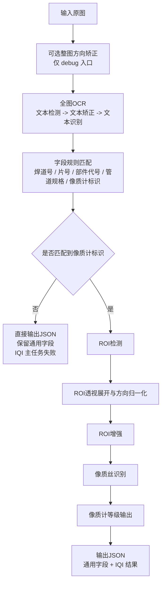

# IQI 像质计等级识别流程

本文档说明当前工程中 IQI 像质计识别、焊道号 / 片号识别以及像质丝等级输出的完整算法流程。

当前实现基于以下核心模块：

- `run_iqi_grade_infer.py`
- `run_inference_pipeline.py`
- `gauge/iqi_inferencer.py`
- `gauge/ocr_stage.py`
- `gauge/iqi_rules.py`
- `gauge/fclip_stage.py`
- `gauge/roi_stage.py`

## 1. 入口与职责划分

当前工程有两个入口：

- `run_iqi_grade_infer.py`
  - 交付入口
  - 输入图像路径 / 图像目录 / 路径列表
  - 输出一个批量 JSON 文件
  - 不再暴露整图方向矫正参数
- `run_inference_pipeline.py`
  - debug 入口
  - 与交付入口调用同一个核心推理接口
  - 保留整图方向矫正和可视化落盘能力

二者共用的核心服务是：

- `gauge/iqi_inferencer.py`

## 2. 当前使用的模型

完整流程由 4 个模型组成：

1. 全图 OCR 模型
- PaddleOCR TextDetection
- PaddleOCR TextRecognition
- 负责在整图上检测和识别文本

2. 文本方向矫正模型
- `models/ocr_orientation_model.pth`
- 作用在单个文本框 crop 上
- 用于把文本框恢复到正常可读方向后再识别

3. 像质计 ROI 检测模型
- YOLO-OBB
- 在整图上定位像质计 ROI

4. 像质丝识别模型
- FClip
- 在 ROI 灰度增强图上输出像质丝数量和线段端点

说明：

- OCR 的 det / rec 放在独立子进程中执行
- 这样可以避免 torch 与 paddle 在同一进程下的 GPU 冲突
- 当前 `models/OCR_rec_inference_best_accuracy` 已覆盖所有目标字符，因此不再区分双识别头

## 3. 输入与批处理方式

交付入口支持三种输入：

- `--image-path`
- `--image-dir`
- `--image-list`

系统会把每张图像独立推理，并最终汇总成单个 JSON 文件。

## 4. 新的端到端算法流程

当前算法主流程如下：

1. 读取原图
2. 可选整图方向矫正（仅 debug 入口）
3. 全图 OCR
4. 在全图 OCR 结果上做字段规则匹配
5. 若像质计标识匹配失败，直接输出 JSON
6. 若像质计标识匹配成功，再启动 ROI / FClip / 等级计算路线
7. 汇总输出最终 JSON

可以概括为：



## 5. 全图 OCR 子流程

### Step 5.1 文本检测

在整张图像上运行 PaddleOCR `TextDetection`：

- 输入：整图
- 输出：若干文本多边形框 `dt_polys`

### Step 5.2 文本框 crop

对每个文本检测框：

- 按检测框四点做透视裁剪
- 得到单独的文本 patch

### Step 5.3 文本方向矫正

对每个文本 patch：

- 调用文本方向矫正模型
- 自动恢复旋转 / 镜像错误
- 输出矫正后的识别输入

### Step 5.4 文本识别

把矫正后的文本 patch 送入文本识别模型：

- 输出 `text`
- 输出 `score`
- 输出每个文本框的 box、det_score、orientation、状态信息

说明：

- 这里已经不再局限于 ROI 内文本
- 是对整张图做完整 OCR
- 后续所有字段提取都以这一步的全图 OCR 结果为基础

## 6. 字段规则匹配

这一部分全部集中在：

- `gauge/iqi_rules.py`

### 6.1 焊道号 / 片号规则

迁移自 WeldOCR 的策略：

- 基本形式：`数字(+|-)数字+可选字母`
- 示例：
  - `66+2Y`
  - `28+3`

解析结果会拆成两个独立字段：

- `weld_no`
- `film_no`

输出时同时保留：

- `weld_film_pairs`
- `weld_numbers`
- `film_numbers`

### 6.2 检测部件代号规则

规则：

- `数字 + S/R + 数字`
- 示例：
  - `4S9`
  - `4R11`

输出字段：

- `component_codes`

### 6.3 管道规格规则

规则：

- `数字 + X/x/× + 数字`
- 示例：
  - `57X12`
  - `57×12`

输出字段：

- `pipe_specs`
- 结构化拆分为：
  - `outer_diameter`
  - `wall_thickness`

### 6.4 像质计标识规则

像质计标识继续沿用当前 IQI 工程中的策略，不使用 WeldOCR 的旧像质计规则。

类型判定：

- 包含 `FE`：`uniform`
- 包含 `NI`：`gradient`
- 同时包含 `E` 和 `J`：也可判为 `uniform`
- 同时包含 `I` 和 `J`：也可判为 `gradient`

数字规则：

- 默认允许范围：`6,10-15`
- 允许单数字 `6`，会被标准化输出为 `06`
- 可通过参数 `--ocr-number-range` 修改允许集合
- 仍然只按单个 OCR 文本框独立匹配
- 不做跨文本框拼接

典型输出：

- `FE06JB`
- `FE10JB`
- `NI13JB`

## 7. ROI / FClip / 等级分支

只有当全图 OCR 成功匹配到合法像质计标识时，才会进入这条分支。

### Step 7.1 ROI 检测

使用 YOLO-OBB 在整图上检测像质计 ROI：

- 若没有 ROI：`1101 roi_not_found`
- 若 ROI 透视展开失败：`1102 roi_invalid`

### Step 7.2 ROI 透视展开与方向归一化

对 ROI 做：

1. 四点排序
2. 透视展开
3. 若 `width > height`，逆时针旋转 90°

目的：

- 统一 ROI 姿态
- 便于后续增强和像质丝识别

### Step 7.3 ROI 增强

当前默认增强方式：

- 灰度化
- window/level 拉伸
- CLAHE 对比度增强

这张增强后的 ROI 灰度图会作为 FClip 的输入。

### Step 7.4 像质丝识别

FClip 输出：

- `wire_count`
- `parsed_line_count`
- 每条像质丝线段端点

每条线段最终输出三套坐标：

- `roi_xy`
- `roi_unrotated_xy`
- `image_xy`

其中：

- `image_xy` 是映射回原图坐标系后的端点
- 方便集成侧直接在原图上做可视化或后处理

### Step 7.5 等级计算

等级规则：

- `uniform`
  - 若 `wire_count > 2`
  - 则 `grade = OCR数字`
- `gradient`
  - 若 `wire_count >= 1`
  - 则 `grade = OCR数字 + wire_count - 1`

失败情况：

- `3003 wire_count_insufficient_uniform`
- `3004 wire_count_insufficient_gradient`
- `3005 grade_out_of_range`

## 8. 输出结构

当前单图结果主要分成两部分：

1. IQI 主任务结果
- `ok`
- `result_code`
- `result_name`
- `result_message`
- `grade`
- `iqi_type`
- `plate_code`
- `plate_number`
- `wire_count`

2. 全图 OCR 提取出的通用字段
- `fields.component_codes`
- `fields.weld_film_pairs`
- `fields.weld_numbers`
- `fields.film_numbers`
- `fields.pipe_specs`

补充字段：

- `field_statistics`
- `general_fields_found`
- `iqi_marker_found`

说明：

- `ok/result_code` 仍然只表示 IQI 主任务是否成功
- 即使通用字段识别成功，只要像质计标识或等级失败，整体 `ok` 仍然是 `false`

## 9. 批量统计

批量输出 summary 中除了原有 IQI 统计，还会新增：

- `field_totals`
- `images_with_general_fields`
- `images_with_iqi_marker`

用于统计全图 OCR 字段匹配情况。

## 10. Debug 可视化

在 debug 入口中，若开启 `--vis`，会保存：

- 原图输入图
- 全图 OCR 可视化图
- 每个 OCR 文本框的：
  - `crop`
  - `rec_input`
  - `rec_result`
- 若进入 ROI 分支，还会额外保存：
  - ROI 可视化图
  - ROI 图
  - ROI 灰度增强图
  - FClip 线段结果图

## 11. 交付命令示例

```bash
cd /home/cht/code/IQIdet

/home/cht/miniconda3/envs/weld-gpu/bin/python run_iqi_grade_infer.py \
  --image-dir IQIdata/ori/img \
  --gauge-weights models/guagerotation.pt \
  --fclip-ckpt models/fclip67.pth.tar \
  --fclip-config models/fclip_config.yaml \
  --output-json outputs/iqi_grade_infer/iqi_grade_results.json \
  --ocr-det-model-name PP-OCRv5_server_det \
  --ocr-rec-model-dir models/OCR_rec_inference_best_accuracy \
  --enable-ocr-orientation \
  --ocr-orientation-model models/ocr_orientation_model.pth \
  --ocr-orientation-device cuda:0 \
  --ocr-number-range 6,10-15
```
