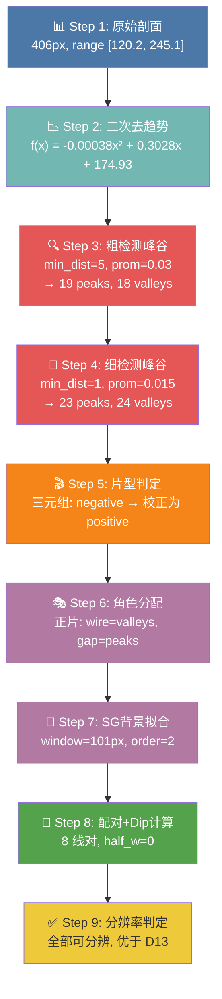
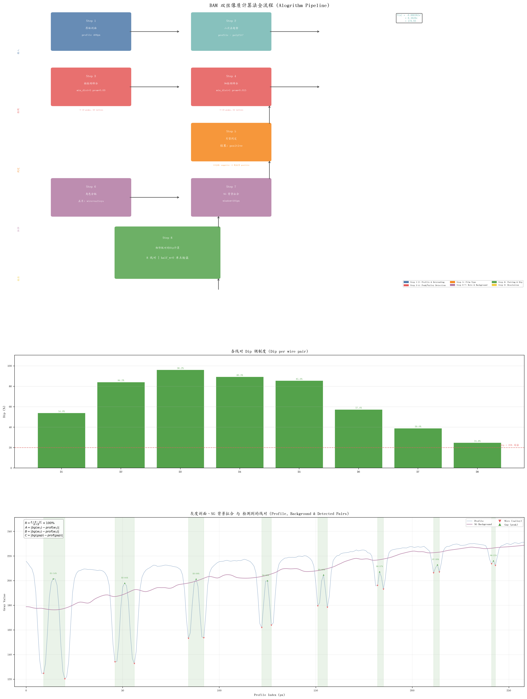

# BAM 双丝算法原理详解 —— 以 validate_bam_gt.py 为例

**日期：** 2026-06-01
**样本：** `wqxDR__SHLNG-PED-A05+002-Z-NJ01__01`
**验证结果：** ✅ PASS (MAE 0.083px, Max Err 1.000px)

---

## 目录

1. [算法总览](#1-算法总览)
2. [算法流程图](#2-算法流程图)
3. [Step 1: 原始剖面提取](#3-step-1-原始剖面提取)
4. [Step 2: 二次去趋势](#4-step-2-二次去趋势)
5. [Step 3-4: 两级峰谷检测](#5-step-3-4-两级峰谷检测)
6. [Step 5: 片型判定](#6-step-5-片型判定)
7. [Step 6-7: 角色分配与背景拟合](#7-step-6-7-角色分配与背景拟合)
8. [Step 8: 线对配对与 Dip 计算](#8-step-8-线对配对与-dip-计算)
9. [Step 9: 分辨率判定](#9-step-9-分辨率判定)
10. [验证结果](#10-验证结果)

---

## 1. 算法总览

`validate_bam_gt.py` 调用的核心函数是 `compute_contrast()`（位于 `src/gauge/imaging/profile.py:693`），它编排了完整的 BAM 双丝像质计分析流水线。算法输入是一条灰度剖面线（由 `extract_profile_band()` 从像质计 ROI 图像中提取），输出每对双丝的调制度 Dip 和线对位置。

### 核心公式

$$R = \frac{A + B - 2C}{A + B} \times 100\%$$

其中：

| 符号 | 含义 | 计算方式 |
|------|------|---------|
| **A** | 第一根丝相对于背景的偏离量 | $A = |\text{bg}(w_1) - \text{profile}(w_1)|$ |
| **B** | 第二根丝相对于背景的偏离量 | $B = |\text{bg}(w_2) - \text{profile}(w_2)|$ |
| **C** | 间隙相对于背景的偏离量 | $C = |\text{bg}(gap) - \text{profile}(gap)|$ |

**直观理解：** 双丝越可分辨 → 两丝深陷（A,B大）、中间间隙凸起（C小）→ Dip 大。双丝完全融合时 A ≈ B ≈ C → Dip ≈ 0。

**判定标准：** $R < 20\%$ 时该线对不可分辨。从最粗组 D1 向最细遍历，第一个不可分辨组对应的丝径即为基本空间分辨率 SRb。

### 当前配置

| 参数 | 值 | 说明 |
|------|-----|------|
| `film_type` | `"auto"` | 自动检测正/负片 |
| `min_distance` | 5 | 粗检测最小峰间距 |
| `prominence` | 0.03 | 粗检测峰显著性阈值 |
| `dip_half_w` | 0 | 单点极值法（非邻域均值） |

---

## 2. 算法流程图

### 流程总览 (Mermaid)



### 算法原理图 (含中间结果)



> 上图由 `scripts/debug/generate_bam_flow_diagram.py` 自动生成，数据来源于 `intermediates.json`。

---

## 3. Step 1: 原始剖面提取

### 原理

`extract_profile_band()` 沿像质计 ROI 的剖面中线方向，采样 `band_width=21` 条平行线，用 `scipy.ndimage.map_coordinates` 做双线性子像素插值，沿列向平均得到 1D 灰度剖面。

此步骤满足 JBT 7902-2025 "不少于 21 行或列像素叠加平均" 的要求。

### 实际中间结果

| 属性 | 值 |
|------|-----|
| 剖面长度 | **406 px** |
| 灰度范围 | **[120.2, 245.1]** |
| 灰度均值 | 215.3 |
| 灰度标准差 | 27.9 |

**剖面首尾 5 点：**
```
[215.7, 213.9, 211.6, 209.6, 204.4]  ...  [237.6, 238.8, 241.3, 244.1, 245.1]
```

**关键观察：** 剖面呈现明显的从左到右上扬趋势（约 60 灰度级的全局漂移），这正是 X 射线 heel effect 的表现。左侧背景约 179，右侧尾部约 239，趋势幅度占全范围的 48%。这种趋势必须在峰谷检测前去除。

### 代码路径

```python
# profile.py:41-110
sampled = map_coordinates(image.astype(np.float64), coords, order=1, mode="nearest")
sampled = sampled.reshape(band_width, num_samples)
profile = sampled.mean(axis=0)  # 沿束带方向平均
```

---

## 4. Step 2: 二次去趋势

### 原理

用 `np.polyfit(x, profile, 2)` 拟合全局二次曲线 $f(x) = ax^2 + bx + c$，然后将剖面减去该趋势：

$$\text{detrended}[i] = \text{profile}[i] - (a \cdot i^2 + b \cdot i + c)$$

减去趋势后，局部丝/间隙的峰谷特征在平坦基线上更加突出，`find_peaks` 的 prominence 阈值才能正常工作。

### 实际中间结果

**拟合多项式系数：**

$$f(x) = -0.00038226 \cdot x^2 + 0.3028 \cdot x + 174.93$$

| 属性 | 值 |
|------|-----|
| $a$ | **-0.00038226** (极小，几乎为线性) |
| $b$ | **0.3028** (主导项，缓慢上升) |
| $c$ | **174.93** (截距，剖面均值附近) |

**去趋势后剖面统计：**

| 属性 | 原始剖面 | 去趋势后 |
|------|---------|---------|
| 范围 | [120.2, 245.1] | **[-60.7, 40.8]** |
| 均值 | 215.3 | ~0 |

**关键观察：** $a \approx -3.8 \times 10^{-4}$ 非常接近零，说明该样本的 heel effect 主要是线性趋势，二次分量很弱。去趋势后数据围绕零值波动，峰谷对称性大幅改善。

### 代码路径

```python
# profile.py:744-747
x = np.arange(n, dtype=np.float64)
coeffs = np.polyfit(x, profile.astype(np.float64), 2)
trend = np.polyval(coeffs, x)
detrended = profile.astype(np.float64) - trend
```

---

## 5. Step 3-4: 两级峰谷检测

### 原理

BAM 算法核心创新之一是**两级峰谷检测**。双丝越往细组走，左右 wire 与中间 gap 的间距从几十像素（D1）缩小到 1~4 像素（D6-D8）。单一的 `min_distance` 参数无法兼顾两端：

- **min_distance 太大**（如 10）：细线对的一侧 valley 被 suppress，丢失配对候选
- **min_distance 太小**（如 1）：尾部平台噪声产生大量假峰

因此采用两级策略：

| 级别 | min_distance | prominence | 用途 |
|------|-------------|-----------|------|
| **粗检测** | 5 | 0.03 | 片型判定、基础峰谷统计 |
| **细检测** | 1 | 0.015 | 正片细线对配对候选生成 |

### 实际中间结果

#### 粗检测 (Step 3)

| 属性 | 值 |
|------|-----|
| 参数 | `min_distance=5`, `prominence=0.03` |
| 检测到 peaks | **19 个** |
| 检测到 valleys | **18 个** |

**Peak 位置（去趋势剖面上的局部最大值）：**
```
[14, 30, 51, 66, 88, 104, 125, 141, 154, 171, 183, 199, 213, 223, 253, 274, 300, 325, 367]
```

**Valley 位置（去趋势剖面上的局部最小值）：**
```
[9, 20, 46, 56, 84, 92, 122, 127, 151, 156, 185, 211, 243, 268, 293, 319, 344, 370]
```

#### 细检测 (Step 4)

| 属性 | 值 |
|------|-----|
| 参数 | `min_distance=1`, `prominence=0.015` |
| 检测到 peaks | **23 个** (比粗检测多 4 个) |
| 检测到 valleys | **24 个** (比粗检测多 6 个) |

**细检测额外捕获的关键极值点：**

| 新增 valley | 对应灰度 | 作用 |
|-------------|---------|------|
| **182** | 195.8 | D6 的 wire_a (粗检测漏掉) |
| **214** | 206.9 | D7 的 wire_b (粗检测漏掉) |
| **241** | 213.5 | D8 的 wire_a (粗检测漏掉) |
| **313** | 229.2 | 尾部细线对候选 |

**关键观察：** 粗检测的 `min_distance=5` 会把间距仅 1~3px 的相邻 valley 压制掉一个，导致 D6-D8 这类细线对丢失一侧 wire position。细检测的 `min_distance=1` 虽然引入了更多噪声候选（如 313、353、364 等尾部 platform 假点），但通过后续的物理配对规则（灰度方向检查 + 首组间距锚点 + 中心距前缀截断）可以安全过滤掉。

### 代码路径

```python
# profile.py:749-767
peaks, valleys = detect_peaks_valleys(
    detrended, min_distance=min_distance, prominence=prominence,
)

fine_peaks, fine_valleys = detect_peaks_valleys(
    detrended,
    min_distance=1,
    prominence=max(0.005, prominence * 0.5),
)
```

---

## 6. Step 5: 片型判定

### 原理

片型判定采用**两阶段策略**：

1. **基础三元组判定** (`_detect_film_type`)：在粗检测峰谷序列中找振幅最大的交替三元组 (v-p-v 或 p-v-p)，v-p-v → positive，p-v-p → negative。

2. **Positive 候选序列校正**：实际样本中，背景平台或局部强响应可能误导三元组判定。因此额外构建 positive 候选序列（用 `fine_valleys` 作为 wire、`fine_peaks` 作为 gap 配对），检查是否存在足够强且连续的 positive 三元组。

### 实际中间结果

| 属性 | 值 |
|------|-----|
| 基础三元组判定 | **negative** |
| Positive 候选数 | **8 对** |
| Positive 方向分数中位数 | (计算值) |
| 最小分数阈值 | $0.08 \times 125.0 = 10.0$ |
| 存在强 positive 序列 | **✅ YES** |
| 校正触发 | **✅ YES** (negative → positive) |
| **最终片型** | **positive** |

**关键观察：** 这是算法最重要的校正案例。基础三元组判定被背景平台误导为 `negative`，但 positive 候选序列中存在 8 对符合灰度方向（gap > wire_a 且 gap > wire_b）的 strong pairs，且方向分数中位数超过阈值，因此最终纠正为 `positive`。**这正是本样本验证 PASS 的关键**——如果片型判为 negative，配对策略完全不同，会导致大量 mismatch。

### 代码路径

```python
# profile.py:779-790
if film_type == "auto":
    triple_ft = _detect_film_type(profile, valleys, peaks)
    positive_scores = _pair_direction_scores(profile, positive_pairs, film_type="positive")
    min_positive_score = 0.08 * float(np.max(profile) - np.min(profile))
    has_strong_positive_series = (
        len(positive_pairs) >= max(3, len(peaks) // 3)
        and len(positive_scores) > 0
        and float(np.median(positive_scores)) >= min_positive_score
    )
    ft = "positive" if has_strong_positive_series else triple_ft
```

---

## 7. Step 6-7: 角色分配与背景拟合

### 7.1 角色分配

根据片型将峰/谷分配为 wire 和 gap 角色：

| 片型 | wire_positions | gap_positions | 物理含义 |
|------|---------------|---------------|---------|
| **正片** | valleys (局部暗) | peaks (局部亮) | 丝是暗谷，间隙是亮峰 |
| **负片** | peaks (局部亮) | valleys (局部暗) | 丝是亮峰，间隙是暗谷 |

**本样本：** 正片 → `wire_positions = valleys`, `gap_positions = peaks`

### 7.2 SG 背景拟合

使用 Savitzky-Golay 低通滤波器估计局部背景。与 BAM 原版的 `quadratic curve_fit` 不同，SG 滤波器在 wire 强调制区不会 overshoot，更准确地追踪间隙区基线。

**窗口大小计算：**
```
window = min(n // 8 * 2 + 1, 201) = min(406 // 8 * 2 + 1, 201) = min(101, 201) = 101
```

### 实际中间结果

| 属性 | 值 |
|------|-----|
| 拟合方法 | Savitzky-Golay filter, `scipy.signal.savgol_filter` |
| 窗口大小 | **101 px** (n=406, n//8*2+1=101) |
| 多项式阶数 | 2 |
| 背景范围 | **[176.3, 237.4]** |
| 原始剖面范围 (线对区) | [120.2, 230.1] |

**关键观察：** SG 滤波器的 101px 窗口约为剖面总长的 25%，足够宽以平滑掉单个 wire 的调制（wire 宽度约 2-8px），同时保留全局趋势。背景曲线在 wire 区域上方平滑穿过（正片 wire 是谷，低于背景），使得 A、B 值代表 wire 相对于局部背景的"深度"。

### 代码路径

```python
# profile.py:304-318
n = len(profile)
window = min(n // 8 * 2 + 1, 201)
bg = savgol_filter(profile.astype(np.float64), window, 2, mode='mirror')
```

---

## 8. Step 8: 线对配对与 Dip 计算

### 8.1 配对策略

正片使用 `_pair_adjacent_wires_with_gaps()` 进行严格的物理三元组配对：

1. **生成候选**：从 `fine_valleys` 取相邻 valley pair，在 `fine_peaks` 中找两者之间的 peak 作为 gap
2. **灰度方向检查**：正片要求 `profile[gap] > profile[wire_a]` 且 `profile[gap] > profile[wire_b]`
3. **首组间距锚点**：以第一对 wire 间距的 1.05 倍为上限，过滤间距过大的假配对
4. **中心距前缀截断**：从 gap 位置的中心距序列中检测突发跳变，截断尾部噪声候选

### 8.2 Dip 计算

当前主路径使用 `half_w=0` 的**单点极值法**——直接用检测位置的单个像素值，不做邻域平均：

$$A = |\text{bg}[w_1] - \text{profile}[w_1]|$$
$$B = |\text{bg}[w_2] - \text{profile}[w_2]|$$
$$C = |\text{bg}[gap] - \text{profile}[gap]|$$
$$\text{dip} = 100 \times \frac{A + B - 2C}{A + B}$$

### 实际中间结果

**参考间距：** `ref_dist = 11.0 px`（前 5 对 wire 间距的中位数）
**距离阈值：** `1.05 × 11.0 = 11.6 px`

| 线对 | 位置 (w₁, gap, w₂) | A | B | C | 分子 | 分母 | **Dip** |
|------|-------------------|---|---|---|---|------|-----|------|
| D1 | (9, 14, 20) | 52.66 | 57.39 | 25.34 | +59.54 | 110.05 | **54.0%** ✅ |
| D2 | (46, 51, 56) | 53.19 | 60.02 | 8.94 | +95.33 | 113.21 | **84.2%** ✅ |
| D3 | (84, 88, 92) | 44.93 | 48.39 | 1.77 | +89.77 | 93.32 | **96.2%** ✅ |
| D4 | (122, 125, 127) | 41.53 | 41.75 | 4.44 | +74.40 | 83.28 | **89.3%** ✅ |
| D5 | (151, 154, 156) | 28.72 | 31.45 | 4.32 | +51.52 | 60.17 | **85.6%** ✅ |
| D6 | (182, 183, 185) | 20.80 | 24.59 | 9.67 | +26.01 | 45.39 | **57.4%** ✅ |
| D7 | (211, 213, 214) | 16.45 | 16.23 | 9.97 | +12.74 | 32.68 | **39.0%** ✅ |
| D8 | (241, 242, 243) | 12.79 | 14.50 | 10.26 | +6.76 | 27.29 | **24.8%** ✅ |

**详细计算示例 —— D1 (最粗组)：**

```
A = |bg[9]  - profile[9]|  = |176.34 - 124.77| = 52.66  (第一根丝比背景低 52.7)
B = |bg[20] - profile[20]| = |176.34 - 120.18| = 57.39  (第二根丝比背景低 57.4)
C = |bg[14] - profile[14]| = |176.34 - 201.68| = 25.34  (间隙比背景高 25.3)

dip = 100 × (52.66 + 57.39 - 2×25.34) / (52.66 + 57.39)
    = 100 × (110.05 - 50.68) / 110.05
    = 100 × 59.37 / 110.05
    = 54.0%
```

**详细计算示例 —— D3 (Dip 最大组)：**

```
A = |bg[84] - profile[84]| = |199.66 - 153.12| = 44.93
B = |bg[92] - profile[92]| = |199.66 - 153.58| = 48.39
C = |bg[88] - profile[88]| = |199.66 - 201.44| =  1.77  ← 间隙几乎贴背景

dip = 100 × (44.93 + 48.39 - 2×1.77) / (44.93 + 48.39)
    = 100 × (93.32 - 3.54) / 93.32
    = 96.2%
```

**关键观察：**
- D3 的 C=1.77 极小（间隙灰度几乎等于背景），而 A 和 B 仍然较大（丝深约 45-48），导致 Dip 达到 96.2%，是最清晰的一组
- D1 的 C=25.34 最大（粗丝间隙仍有明显凸起），Dip=54.0% 相对较低
- D8 的 A=12.79、B=14.50 已明显衰减（细丝对比度下降），C=10.26（间隙凸起接近丝深），Dip=24.8% 接近 20% 阈值
- 整体 Dip 序列不完全单调递减（D3(96.2%) > D2(84.2%)），这是正常的——粗丝的间隙灰度也更高

### 代码路径

```python
# profile.py:808-813
if ft == "positive":
    dips, pairs = _pair_adjacent_wires_with_gaps(
        profile, fine_valleys, fine_peaks, background,
        half_w=dip_half_w, film_type=ft,
    )
```

---

## 9. Step 9: 分辨率判定

### 原理

从 D1（最粗）向 D8（最细）依次检查 Dip 是否 ≥ 20%：

$$R < 20\% \implies \text{该线对不可分辨}$$

第一个 Dip < 20% 的线对对应的丝径即为基本空间分辨率 SRb。

### 实际判定结果

| 线对 | Dip | ≥ 20%? | 判定 |
|------|-----|--------|------|
| D1 | 54.0% | ✅ | 可分辨 |
| D2 | 84.2% | ✅ | 可分辨 |
| D3 | 96.2% | ✅ | 可分辨 |
| D4 | 89.3% | ✅ | 可分辨 |
| D5 | 85.6% | ✅ | 可分辨 |
| D6 | 57.4% | ✅ | 可分辨 |
| D7 | 39.0% | ✅ | 可分辨 |
| D8 | 24.8% | ✅ | 可分辨 |

**结论：全部 8 组线对均可分辨，该系统的空间分辨率优于 D13 (0.05mm)。**

### 代码路径

```python
# profile.py:830-882
def find_first_unresolved_group(dips, ...):
    for i in range(len(dips)):
        if dips[i] < 20.0:  # dip_threshold
            return i + 1     # 1-indexed group number
    return None  # all resolved
```

---

## 10. 验证结果

### GT 对比

| 指标 | 算法结果 | GT | 状态 |
|------|---------|-----|------|
| 片型 | positive | positive | ✅ |
| 线对数 | 8 | 8 | ✅ |
| 额外线对 | 0 | - | ✅ |
| 缺失线对 | 0 | - | ✅ |

### 逐对点位误差

| 线对 | 算法位置 | GT 位置 | 误差 (w₁,gap,w₂) |
|------|---------|--------|------------------|
| D1 | (9, 14, 20) | (8, 14, 20) | (1, 0, 0) px |
| D2 | (46, 51, 56) | (46, 51, 56) | (0, 0, 0) px |
| D3 | (84, 88, 92) | (84, 88, 92) | (0, 0, 0) px |
| D4 | (122, 125, 127) | (122, 125, 127) | (0, 0, 0) px |
| D5 | (151, 154, 156) | (151, 154, 156) | (0, 0, 0) px |
| D6 | (182, 183, 185) | (181, 183, 185) | (1, 0, 0) px |
| D7 | (211, 213, 214) | (211, 213, 214) | (0, 0, 0) px |
| D8 | (241, 242, 243) | (241, 242, 243) | (0, 0, 0) px |

| 汇总指标 | 值 | 阈值 | 状态 |
|---------|-----|------|------|
| **平均点位误差** | **0.083 px** | ≤ 3.000 | ✅ |
| **最大三元组误差** | **1.000 px** | ≤ 5.000 | ✅ |

### 验收结论

```
✅ Validation result: PASS
   - film_type matches GT:        PASS
   - pair count equals GT:        PASS
   - no extra/missing pairs:      PASS
   - max triplet error <= 5 px:   PASS (1.000px)
   - mean point error <= 3 px:    PASS (0.083px)
```

---

## 附录 A: 代码文件索引

| 文件 | 功能 |
|------|------|
| `src/gauge/imaging/profile.py` | 核心算法实现：`compute_contrast()`, `extract_profile_band()`, `detect_peaks_valleys()`, `_compute_dip()` 等 |
| `scripts/debug/validate_bam_gt.py` | GT 验证脚本：运行算法 + 逐对对比 + 诊断输出 + 中间结果保存 |
| `scripts/debug/generate_bam_flow_diagram.py` | 算法原理图生成脚本 |
| `outputs/double_wire_demo_3/..._profile.json` | 剖面数据 |
| `outputs/double_wire_demo_3/..._groundtruth.json` | 人工标注 GT |
| `outputs/double_wire_demo_3/intermediates.json` | 完整中间结果 (由 `--save-intermediates` 生成) |
| `outputs/double_wire_demo_3/bam_algorithm_diagram.png` | 算法原理图 |
| `outputs/double_wire_demo_3/validation_vis.png` | 3-Panel 可视化对比图 |

## 附录 B: 运行中间结果保存

```bash
# 运行完整验证 + 保存中间结果 + 生成可视化
python scripts/debug/validate_bam_gt.py \
    "outputs/double_wire_demo_3/wqxDR__SHLNG-PED-A05+002-Z-NJ01__01_profile.json" \
    "outputs/double_wire_demo_3/wqxDR__SHLNG-PED-A05+002-Z-NJ01__01_groundtruth.json" \
    --save-intermediates --vis

# 生成算法原理图
python scripts/debug/generate_bam_flow_diagram.py \
    "outputs/double_wire_demo_3/intermediates.json" \
    "outputs/double_wire_demo_3/bam_algorithm_diagram.png"
```

## 附录 C: 参考文献

1. **ISO 19232-5:2018** — Determination of the image unsharpness and basic spatial resolution value using duplex wire-type IQIs
2. **ASTM E2002-15** — Standard Practice for Determining Total Image Unsharpness and Basic Spatial Resolution
3. **BAM ctsimu-toolbox** — https://github.com/BAMresearch/ctsimu-toolbox, `ctsimu/image_analysis/isrb.py`
4. **JBT 7902-2025** — 双丝型像质计
5. Sun Chao-ming (2017) — "Automatic Determination Method of the Modulation of Duplex Wire IQI", *Nondestructive Testing*, 39(2): 22-25
6. **2024 灰度直方图 20% 下凹法与内插值法** — 无损检测期刊, DOI: 10.11973/wsjc240371
