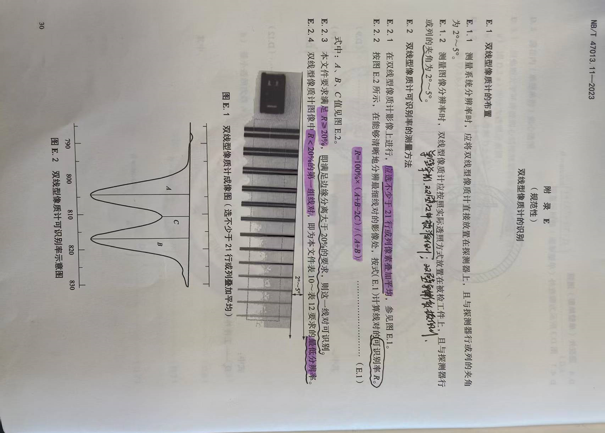
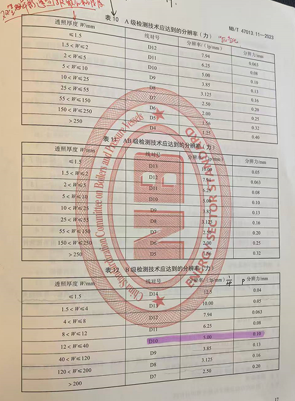

# 双丝像质计：分辨率计算逻辑

## 图像标识

通过文件名或代码前缀区分图像类型：

- **双丝图像**：以 `GB`/`ISO` 开头
- **单丝图像**：无前缀

## 分辨率与双丝识别逻辑

### 判定算法（波峰两波谷法）

**原理**：选取两个黑区灰度值 $a, b$ 和中间白区灰度值 $c$（黑区和白区是相对的，因为存在正负片观察）。

**公式**：

$$Contrast = \frac{a + b - 2c}{a + b}$$

**阈值**：$Contrast > 20\%$ 视为可识别。

### 最小分辨率确定

1. 从粗到细遍历双丝组
2. 找到第一个 $Contrast < 20\%$ 的组
3. 此组即为系统可识别的最小分辨率组

### 输出形式

系统输出"第几组"，通过查表转换为具体物理尺寸（如第 8 组对应 0.6mm）。

### 标准更新

团标即将发布，双丝组数由 13 组扩展至 15-18 组，且采用分段处理，间隙随位置变化。如果是分段处理的双丝，只要知道每个分段的第一组丝是 $D$ 几就可以算出后面的 $D$ 几。

---

---

# 双丝像质计：分辨率计算流程

## Use Case 1: 分辨率计算流程

| 角色 | 说明 |
|------|------|
| **参与者** | 质检员、算法引擎 |
| **前置条件** | 上传 16 位双丝图像（GB/ISO 标识），已完成尺寸校准 |

### 基本流程

1. **系统识别图像类型**（正片/负片），确定查找逻辑：
   - 正片：两黑夹一白
   - 负片：两白夹一黑

2. **系统自动定位**双丝各组的位置。

3. **对每一组**，沿垂直于丝的方向提取像素行，计算 $a, b, c$ 灰度均值。

4. **应用公式** $\frac{a + b - 2c}{a + b}$ 计算可识别率 $R$。

5. **从最粗组开始遍历**，找到第一个对比度 $< 20\%$ 的组。

6. **以此组编号**，并查表转换为物理分辨率数值。

### 异常流

| 异常情况 | 处理方式 |
|----------|----------|
| 未检测到双丝结构 | 报错"非双丝图像或识别失败" |
| 所有组对比度均 $> 20\%$ | 返回最细组的分辨率（超出量程上限） |

> **备注**：所有组对比度均 $> 20\%$ 的情况，如果是分段双丝像质计可能出现，非分段双丝像质计一般不会出现。

---

